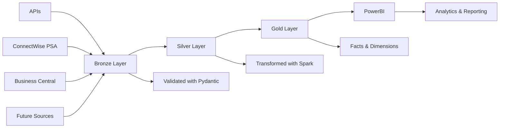

# ConnectWise ETL Framework

A modern, package-based ETL framework implementing medallion architecture (Bronze → Silver → Gold) for Microsoft Fabric OneLake. Specifically designed for ConnectWise PSA integration with fail-fast philosophy and business-specific logic.

[](https://www.python.org/downloads/)
[](https://docs.pydantic.dev/latest/)
[](https://learn.microsoft.com/en-us/fabric/)

## 🚀 Overview

The framework provides a **configuration-driven, fail-fast ETL pipeline** that transforms ConnectWise PSA data into analytics-ready datasets. It handles complex Icelandic business logic while maintaining clean separation between core ETL patterns and ConnectWise-specific logic.

### Key Features

- 🏗️ **Package-Based Architecture**: Clean separation between core ETL patterns and ConnectWise logic
- ⚡ **Fail-Fast Philosophy**: All parameters required, explicit errors, no silent failures
- 🔄 **SparkDantic Integration**: Seamless Pydantic→Spark schema conversion for distributed processing
- 🏛️ **True Medallion Architecture**: Bronze (validated) → Silver (transformed) → Gold (enriched)
- 🎯 **Business Logic Support**: Handles complex rules like Icelandic agreement types
- 🔧 **Microsoft Fabric Optimized**: Built for Fabric Spark runtime environment
- 📊 **Generic Patterns**: Reusable dimension and fact creators
- ⚡ **Performance Strategy**: Row-by-row validation in Bronze, distributed Spark in Silver/Gold

## 🏛️ Architecture

### Package Structure

```
psa-unified-clean/
├── packages/
│   ├── unified-etl-core/          # Foundation framework
│   │   ├── silver.py             # Schema transformation (NO validation)
│   │   ├── facts.py              # Generic fact creator
│   │   ├── dimensions.py         # Dimension generator
│   │   └── generators/           # Model generation framework
│   │
│   ├── unified-etl-connectwise/   # ConnectWise adapter
│   │   ├── client.py             # API client with field selection
│   │   ├── agreement_utils.py    # Icelandic business logic
│   │   └── transforms.py         # Fact table creators
│   │
│   └── unified-etl-businesscentral/ # BC adapter (in progress)
│
├── configs/
│   └── generation.toml           # Model generation config
├── scripts/
│   └── regenerate_models_v2.py   # Unified model generator
└── docs/                         # Documentation
```

### Data Flow



## 🛠️ Installation

### Prerequisites

- **Python 3.11+**
- **Microsoft Fabric workspace** (for production)
- **uv** package manager (recommended)

### Development Setup

```bash
# Clone repository
git clone <repository-url>
cd psa-unified-clean

# Install uv if needed
pip install uv

# Install all packages in development mode
uv pip install -e packages/unified-etl-core[azure]
uv pip install -e packages/unified-etl-connectwise
uv pip install -e packages/unified-etl-businesscentral

# Run tests
uv run pytest

# Type checking
uv run pyright

# Linting
uv run ruff check .
```

## 📖 Quick Start

### 1. Generate Models

Use the unified model generator with auto-detection:

```bash
# Generate ConnectWise models from OpenAPI
python scripts/regenerate_models_v2.py \
    PSA_OpenAPI_schema.json \
    packages/unified-etl-connectwise/src/unified_etl_connectwise/models/models.py

# Generate BC models from CDM
python scripts/regenerate_models_v2.py \
    BC_CDM_manifest.json \
    packages/unified-etl-businesscentral/src/unified_etl_businesscentral/models/ \
    --format cdm
```

### 2. Extract Data

Use the ConnectWise client with automatic field selection:

```python
from unified_etl_connectwise import ConnectWiseClient

# Initialize with environment variables
client = ConnectWiseClient()

# Extract with pagination and validation
time_entries = client.extract(
    endpoint="/time/entries",
    page_size=1000,
    conditions=["dateEntered > '2024-01-01'"]
)

# Extract all supported entities
all_data = client.extract_all()
```

### 3. Create Fact Tables

Apply business logic and create dimensional facts:

```python
from unified_etl_connectwise import create_time_entry_fact
from unified_etl_core.dimensions import create_all_dimensions

# Create comprehensive time entry fact (captures ALL work)
fact_df = create_time_entry_fact(
    spark=spark,
    time_entry_df=time_entries,
    agreement_df=agreements,
    config={
        "include_internal": True,  # Capture missing $18M
        "add_cost_metrics": True
    }
)

# Create dimensions from enum columns
dimensions = create_all_dimensions(
    spark=spark,
    dimension_configs=[
        {"source_table": "silver.time_entries", "column": "billableOption"},
        {"source_table": "silver.agreements", "column": "billingCycle"}
    ]
)
```

### 4. Run Complete Pipeline

Process through medallion architecture:

```python
from unified_etl_core.main import run_etl_pipeline

# Run complete pipeline
run_etl_pipeline(
    sources=["connectwise"],
    layers=["bronze", "silver", "gold"],
    lakehouse_root="/lakehouse/default/Tables/"
)
```

## 🔧 Configuration

### Model Generation (configs/generation.toml)

```toml
[datamodel-codegen]
base-class = "sparkdantic.SparkModel"
snake-case-field = false  # CRITICAL: Preserve camelCase
field-constraints = true
use-schema-description = true
```

### Environment Variables

```bash
# ConnectWise authentication
CW_AUTH_USERNAME=your_username
CW_AUTH_PASSWORD=your_password
CW_CLIENTID=your_client_id

# Business Central
BC_TENANT_ID=xxx
BC_CLIENT_ID=xxx
BC_CLIENT_SECRET=xxx
```

## 💡 Key Concepts

### SparkDantic Integration Strategy

The framework is built on a **schema-first architecture** where SparkDantic models define the data contract across all layers:

```python
# 1. Models inherit from SparkModel (not BaseModel)
from sparkdantic import SparkModel

class TimeEntry(SparkModel):
    id: int
    timeStart: datetime
    actualHours: float

# 2. Runtime schema generation in core framework (silver.py:69)
schema = model_class.model_spark_schema()
df = spark.createDataFrame(validated_data, schema=schema)

# 3. Fail-fast SparkDantic validation (silver.py:116-122)
if not hasattr(model_class, "model_spark_schema"):
    raise ETLConfigError(
        f"Model {model_class.__name__} must inherit from SparkModel. "
        f"All models must be auto-generated with SparkDantic support."
    )
```

**Core Framework Integration**:
- **Entity Configs**: Store actual model classes for runtime schema access (`config/entity.py:61`)
- **Silver Layer**: Pure SparkDantic schema generation - NO FALLBACKS (`silver.py:181`)
- **Type Mapping**: Schema-driven conversions using `spark_schema_fields.get()` (`silver.py:196`)
- **Model Generation**: Auto-configured with SparkDantic base class (`generators/base.py:31`)

**Performance Strategy**: Small API batches get row-by-row Pydantic validation in Bronze, then distributed Spark processing takes over in Silver/Gold for millions of rows.

### Generic vs Specific Architecture

**Generic Core Framework** (packages/unified-etl-core/):
```python
# Reusable patterns that work for any data source
from unified_etl_core.dimensions import add_dimension_keys
from unified_etl_core.facts import add_etl_metadata

fact_df = add_dimension_keys(config, df, dimension_mappings, spark)
fact_df = add_etl_metadata(fact_df, layer="gold", source="connectwise")
```

**Source-Specific Business Logic** (packages/unified-etl-connectwise/):
```python
# ConnectWise-specific Icelandic business rules
AGREEMENT_TYPE_PATTERNS = {
    r"Tímapottur\s*:?": (AgreementType.PREPAID_HOURS, "prepaid"),
    r"yÞjónusta": (AgreementType.BILLABLE_SERVICE, "billable"),
    r"Innri verkefni": (AgreementType.INTERNAL_PROJECT, "internal")
}

# Complex agreement hierarchy with parent-child resolution
def resolve_agreement_hierarchy(agreement_df, time_entry_df):
    # 764 lines of ConnectWise-specific logic
    # Uses generic core patterns but implements specific business rules
```

### Fail-Fast Philosophy

All functions require ALL parameters - no optional behaviors:

```python
# WRONG - optional parameters
def create_fact(df, config=None):
    config = config or {}  # Silent default

# RIGHT - explicit requirements
def create_fact(df: DataFrame, config: dict[str, Any]):
    if not df:
        raise FactTableError("df is required")
    if not config:
        raise FactTableError("config is required")
```

### Layer Responsibilities

1. **Bronze**: Row-by-row Pydantic validation during API extraction (`client.py:446`)
2. **Silver**: Runtime SparkDantic schema application - NO validation needed (`silver.py:69`)
3. **Gold**: Business intelligence on properly-typed DataFrames (`transforms.py`)

**Key Insight**: Silver layer enforces **pure SparkDantic integration with zero fallbacks** - if models don't inherit from `SparkModel`, the framework fails fast rather than attempting manual schema mapping.

## 🏭 Production Deployment

### Build Packages

```bash
# Build all packages
cd packages/unified-etl-core && python -m build --wheel
cd ../unified-etl-connectwise && python -m build --wheel
```

### Deploy to Microsoft Fabric

1. Upload wheel files to lakehouse
2. Install in notebook:
   ```python
   %pip install /lakehouse/Files/unified-etl-core-1.0.0-py3-none-any.whl
   %pip install /lakehouse/Files/unified-etl-connectwise-1.0.0-py3-none-any.whl
   ```
3. Configure Key Vault secrets
4. Run pipeline with Fabric spark

## 🧪 Testing

```bash
# Run all tests
uv run pytest

# Test specific package
uv run pytest packages/unified-etl-core/tests/

# Type checking
uv run pyright packages/

# Linting
uv run ruff check packages/
```

## 📊 Business Value

The framework addresses critical business needs:

- **$18M Cost Recovery**: Captures ALL work including internal projects
- **Tímapottur Tracking**: Proper handling of prepaid hours
- **Generic Patterns**: Add new sources without rewriting core logic
- **Performance**: Leverages Spark for large-scale processing

## 🤝 Contributing

1. Follow the fail-fast philosophy - no optional parameters
2. Maintain clear layer boundaries (Bronze/Silver/Gold)
3. Keep business logic in integration packages
4. Preserve camelCase for API compatibility
5. Add comprehensive tests for new features

## 📄 License

MIT License - see [LICENSE](LICENSE) file for details.

---

**Built with the philosophy: Generic where possible, specialized where necessary**