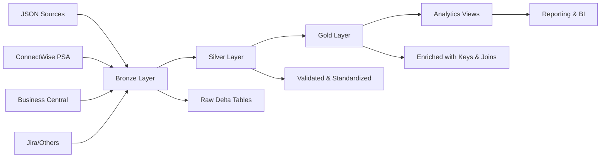

# Unified ETL Framework

A modern Python ETL framework designed for JSON-based data sources targeting Microsoft Fabric OneLake. Built around the synergy of automated model generation, Pydantic validation, and SparkDantic schema conversion for seamless Spark integration.

[](https://www.python.org/downloads/)
[](https://docs.pydantic.dev/latest/)
[](https://learn.microsoft.com/en-us/fabric/)

## 🚀 Overview

This ETL framework implements a **configuration-driven medallion architecture** that transforms raw JSON data from various sources into analytics-ready datasets in Microsoft Fabric OneLake. It currently supports **ConnectWise PSA** and **Microsoft Business Central**, but the generic design makes adding new sources (Jira, Salesforce, etc.) straightforward.

### Key Features

- 🏗️ **Automated Model Generation**: From OpenAPI specs, Common Data Model schemas, or JSON samples
- ⚡ **Generic Processing**: Single codebase handles all entities via configuration
- 🔄 **SparkDantic Integration**: Automatic Spark schema generation from Pydantic models  
- 🏛️ **Medallion Architecture**: Bronze (raw) → Silver (clean) → Gold (enriched)
- 🎯 **Zero Column Pruning**: Gold layer preserves all data; views handle selection
- 🔧 **Microsoft Fabric Optimized**: Built for Fabric Spark runtime environment
- 📊 **Configuration-Driven**: Add new entities without code changes

## 🏛️ Architecture

### Data Flow



### Component Structure

```
unified_etl/
├── models/              # Generated Pydantic models
├── generators/          # Model code generators  
├── extract/            # Generic data extraction
├── bronze/             # Raw data ingestion
├── silver/             # Data validation & cleansing
├── gold/               # Data enrichment & analytics
│   └── generic_fact.py # Universal fact table creator
├── pipeline/           # ETL orchestration
├── storage/            # Delta table operations
└── utils/              # Shared utilities
```

## 🛠️ Installation

### Prerequisites

- **Python 3.11+**
- **Microsoft Fabric workspace** (for production)
- **PySpark 3.3+** (for local development)

### Using uv (Recommended)

```bash
# Install uv if needed
pip install uv

# Install the package
uv pip install -e .

# Install with optional dependencies
uv pip install -e ".[local]"  # For local development with PySpark
uv pip install -e ".[azure]"  # For Azure Key Vault integration
```

### Development Setup

```bash
# Clone and install
git clone <repository-url>
cd unified-etl
uv pip install -e ".[dev]"

# Run tests
uv run pytest

# Type checking
uv run basedpyright

# Linting
uv run ruff check
```

## 📖 Quick Start

### 1. Generate Models

Generate Pydantic models from your data source schemas:

```python
# For ConnectWise PSA (from OpenAPI)
from unified_etl.generators.generate_psa_models import generate_psa_models

generate_psa_models(
    openapi_schema_path="PSA_OpenAPI_schema.json",
    output_dir="unified_etl/models/"
)

# For Business Central (from CDM schemas)  
from unified_etl.generators.generate_bc_models import generate_bc_models

generate_bc_models(
    input_dir="cdm_manifests/",
    output_file="unified_etl/models/bc_models.py"
)
```

### 2. Extract Data

Use the generic extractor to pull data from APIs:

```python
from unified_etl.extract.generic import extract_entity_data
from unified_etl.api.connectwise_client import ConnectWiseClient

# Initialize client
client = ConnectWiseClient(
    company="YourCompany",
    public_key="your_public_key", 
    private_key="your_private_key",
    client_id="your_client_id"
)

# Extract data for any entity
data = extract_entity_data(
    client=client,
    entity_name="Agreement",
    start_date="2024-01-01",
    max_pages=10
)
```

### 3. Run ETL Pipeline

Process data through the medallion architecture:

```python
from unified_etl.main import run_etl

# Run complete pipeline
results = run_etl(
    tables=["Agreement", "TimeEntry", "Customer"],
    lakehouse_root="/lakehouse/default/Tables",
    mode="append"
)

# Check results
for table, success in results.items():
    print(f"{table}: {'✓' if success else '✗'}")
```

### 4. Create Analytics

The gold layer provides enriched data ready for analysis:

```sql
-- Query unified fact tables
SELECT 
    entity_type,
    COUNT(*) as record_count,
    SUM(amount) as total_amount
FROM gold.fact_unified
WHERE created_date >= '2024-01-01'
GROUP BY entity_type
```

## 🔧 Configuration

### Entity Configuration

Define entity behavior via YAML configuration:

```yaml
# config.yaml
entities:
  Agreement:
    gold_name: "fact_agreements"
    surrogate_keys:
      - name: "AgreementKey"
        source_columns: ["id", "companyId"]
    dimension_joins:
      - dimension: "Customer"
        join_keys: {"companyId": "id"}
    calculated_columns:
      monthly_value: "totalAmount / agreementTermMonths"
```

### Data Source Configuration

Configure API connections and extraction parameters:

```python
# In your notebook or script
import os

# Set connection parameters
os.environ['CW_COMPANY'] = 'YourCompany'
os.environ['CW_PUBLIC_KEY'] = 'your_public_key'
os.environ['CW_PRIVATE_KEY'] = 'your_private_key'
os.environ['CW_CLIENTID'] = 'your_client_id'
```

## 🏭 Production Deployment

### Microsoft Fabric

1. **Build Package**:
```bash
python -m build --wheel
```

2. **Upload to Fabric**:
   - Upload wheel file to lakehouse Files
   - Create notebook in your workspace
   - Install package: `%pip install /lakehouse/default/Files/unified_etl-0.1.0-py3-none-any.whl`

3. **Configure Secrets**:
   - Add credentials to workspace Key Vault
   - Reference in your pipeline code

4. **Run Pipeline**:
```python
from unified_etl.main import run_etl

# Fabric-optimized run
results = run_etl(
    lakehouse_root="/lakehouse/default/Tables",
    mode="append",
    log_level="INFO"
)
```

### Incremental Processing

For production workloads, use incremental processing:

```python
from unified_etl.pipeline.silver_gold import run_silver_to_gold_pipeline

# Process only recent changes
results = run_silver_to_gold_pipeline(
    spark=spark,
    silver_db="silver",
    gold_db="gold", 
    is_full_refresh=False,  # Incremental mode
    tables=["Agreement", "TimeEntry"]
)
```

## 🔍 Key Concepts

### Generic Fact Creation

Instead of writing separate fact functions for each entity, use the universal creator:

```python
from unified_etl.gold.generic_fact import create_fact_table

# Works for ANY entity
fact_df = create_fact_table(
    spark=spark,
    silver_df=silver_data,
    entity_name="Agreement",  # Or "Customer", "Invoice", etc.
    gold_path="gold"
)
```

### Model Generation

The framework uses datamodel-code-generator with SparkDantic:

```toml
# pyproject.toml configuration
[tool.datamodel-codegen]
base-class = "sparkdantic.SparkModel"
snake-case-field = false  # Preserve camelCase
output-model-type = "pydantic_v2.BaseModel"
```

### Medallion Architecture

- **Bronze**: Raw JSON data as Delta tables
- **Silver**: Validated, standardized with Pydantic models  
- **Gold**: Enriched with surrogate keys, dimension joins, business logic
- **Views**: Column selection, aggregations, reporting formats

## 🧪 Testing

```bash
# Run all tests
uv run pytest

# Run specific test categories
uv run pytest tests/unit/           # Unit tests
uv run pytest tests/test_*_validation.py  # Validation tests

# Run with coverage
uv run pytest --cov=unified_etl
```

## 📚 API Reference

### Core Classes

- **`ConnectWiseClient`**: HTTP client with retry logic and rate limiting
- **`create_fact_table()`**: Universal fact table creator for all entities
- **`run_etl()`**: Main pipeline orchestrator
- **`generate_psa_models()`**: PSA model generator from OpenAPI
- **`generate_bc_models()`**: BC model generator from CDM schemas

### Configuration Options

- **Entity Config**: Surrogate keys, dimension joins, calculated columns
- **Pipeline Config**: Batch sizes, retry logic, error handling
- **Spark Config**: Optimizations for Fabric runtime

## 🤝 Contributing

1. **Fork the repository**
2. **Create a feature branch**: `git checkout -b feature/amazing-feature`
3. **Make changes and add tests**
4. **Run quality checks**: `uv run ruff check && uv run basedpyright`
5. **Commit changes**: `git commit -m 'Add amazing feature'`
6. **Push to branch**: `git push origin feature/amazing-feature`
7. **Open a Pull Request**

### Code Standards

- **Python 3.11+** with modern typing
- **Pydantic V2** for all data models
- **camelCase** for model fields (matching source systems)
- **snake_case** for Python function/variable names
- **100% type hints** with basedpyright validation

## 📊 Supported Data Sources

| Source | Status | Generator | API Type |
|--------|--------|-----------|----------|
| ConnectWise PSA | ✅ Production | `generate_psa_models` | REST API |
| Microsoft Business Central | ✅ Production | `generate_bc_models` | CDM/OData |
| Jira | 🔄 Planned | `generate_jira_models` | REST API |
| Salesforce | 🔄 Planned | `generate_sf_models` | REST API |

## 🐛 Troubleshooting

### Common Issues

**Import Errors**: Ensure all dependencies installed with `uv pip install -e ".[local]"`

**Schema Mismatches**: Regenerate models after API changes:
```bash
python unified_etl/generators/generate_psa_models.py
```

**Performance Issues**: Check Spark configuration and partition strategy:
```python
# Optimize for Fabric
spark.conf.set("spark.sql.adaptive.enabled", "true")
spark.conf.set("spark.sql.adaptive.coalescePartitions.enabled", "true")
```

### Getting Help

- 📖 **Documentation**: Check inline docstrings and type hints
- 🐛 **Issues**: Report bugs via GitHub Issues  
- 💬 **Discussions**: Ask questions in GitHub Discussions
- 📧 **Email**: Contact maintainers for enterprise support

## 📄 License

MIT License - see [LICENSE](LICENSE) file for details.

## 🙏 Acknowledgments

- **Microsoft Fabric Team** for the excellent Spark runtime
- **Pydantic & SparkDantic** for seamless data validation  
- **ConnectWise** for comprehensive API documentation
- **datamodel-code-generator** for automated model generation

---

**Built with ❤️ for modern data engineering**

Ready to transform your JSON data into analytics gold? Get started with the [Quick Start](#-quick-start) guide!